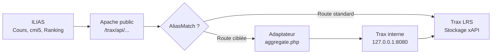
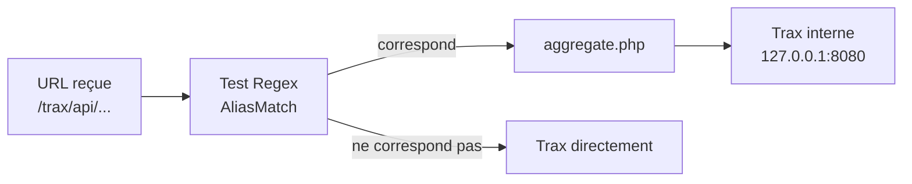
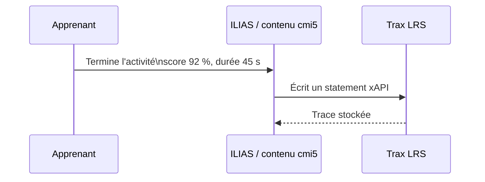
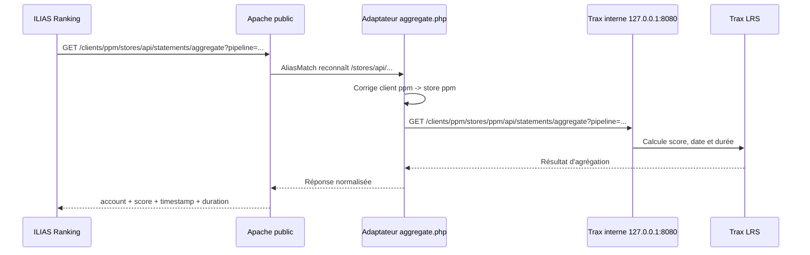

# Trax ILIAS Bridge 2.0.5

**Trax ILIAS Bridge** est un adaptateur léger placé devant Trax LRS pour fiabiliser certains échanges entre **ILIAS**, les contenus **cmi5/xAPI** et **Trax LRS**.

Il ne remplace ni ILIAS ni Trax. Son rôle est d'intercepter quelques requêtes ciblées, de les corriger si nécessaire, puis de les transmettre à Trax via une URL interne.

---

## Sommaire

- [Pourquoi un adaptateur ?](#pourquoi-un-adaptateur-)
- [Ce que résout l'adaptateur](#ce-que-résout-ladaptateur)
- [Principe de fonctionnement](#principe-de-fonctionnement)
- [Architecture simplifiée](#architecture-simplifiée)
- [Fonctionnement Apache avec AliasMatch](#fonctionnement-apache-avec-aliasmatch)
- [Les 4 règles AliasMatch](#les-4-règles-aliasmatch)
- [Exemple détaillé d'une règle AliasMatch](#exemple-détaillé-dune-règle-aliasmatch)
- [Exemple d'acheminement complet Ranking ILIAS](#exemple-dacheminement-complet-ranking-ilias)
- [Périmètre technique](#périmètre-technique)
- [Configuration de l'adaptateur](#configuration-de-ladaptateur)
- [Exemple de configuration Apache](#exemple-de-configuration-apache)
- [Tests de validation](#tests-de-validation)
- [Comportement avec d'autres sources xAPI](#comportement-avec-dautres-sources-xapi)
- [Nouveauté de la version 2.0.5](#nouveauté-de-la-version-205)
- [Dépannage rapide](#dépannage-rapide)

---

## Pourquoi un adaptateur ?

Dans l'architecture cible, trois éléments doivent communiquer correctement :

| Élément | Rôle |
|---|---|
| **ILIAS** | LMS côté apprenant. Il lance les contenus cmi5 et affiche la progression, les résultats et le Ranking. |
| **xAPI / cmi5** | Langage commun des traces d'apprentissage : activité, score, durée, réussite, progression. |
| **Trax LRS** | Référentiel qui reçoit, sécurise et conserve les statements xAPI. |

Dans l'idéal, ILIAS écrit et lit les traces directement dans Trax.

En pratique, certaines requêtes générées par ILIAS ne correspondent pas exactement aux routes attendues côté Trax. Sans adaptation, on peut obtenir :

- des erreurs lors de certaines requêtes ;
- des résultats absents ;
- un onglet **Ranking** vide ;
- des problèmes de lancement ou d'état cmi5 selon les paramètres envoyés.

L'adaptateur sert donc de passerelle discrète entre ILIAS et Trax.

---

## Ce que résout l'adaptateur

L'adaptateur corrige trois familles de problèmes.

### 1. URL `aggregate` incomplète

ILIAS peut appeler une URL d'agrégation sans indiquer le nom du store Trax :

```text
/trax/api/gateway/clients/ppm/stores/api/statements/aggregate
```

Dans ce cas, le chemin contient :

```text
/stores/api/...
```

alors que Trax attend normalement :

```text
/stores/{store}/api/...
```

L'adaptateur retrouve le store à utiliser à partir du client, par exemple :

```text
client ppm -> store ppm
```

Il transmet ensuite à Trax une URL corrigée :

```text
/trax/api/gateway/clients/ppm/stores/ppm/api/statements/aggregate
```

### 2. Paramètre cmi5 non attendu

Certaines requêtes contiennent le paramètre :

```text
activity_id
```

Ce paramètre peut être incompatible avec les routes attendues côté Trax. L'adaptateur le retire avant transmission, sans modifier les paramètres standards tels que :

```text
activityId
agent
stateId
registration
```

### 3. Ranking ILIAS

Pour le Ranking, ILIAS attend une réponse contenant notamment :

```text
account
score
timestamp
duration
```

L'adaptateur reformate les résultats d'agrégation pour renvoyer une réponse exploitable par ILIAS.

---

## Principe de fonctionnement

L'adaptateur agit comme un agent de circulation.

Il ne crée pas les traces xAPI. Il ne remplace pas Trax. Il ne modifie pas ILIAS.

Il intervient uniquement lorsqu'une requête correspond à une route ciblée.

### Ce qu'il fait

- il reconnaît les URLs concernées ;
- il corrige le store manquant ;
- il nettoie les paramètres incompatibles ;
- il transmet la requête à Trax via une URL interne ;
- il reformate certaines réponses pour ILIAS, notamment pour le Ranking.

### Ce qu'il ne fait pas

- il ne remplace pas Trax LRS ;
- il ne remplace pas ILIAS ;
- il ne réécrit pas toutes les traces ;
- il ne stocke pas les résultats ;
- il ne filtre pas automatiquement les traces provenant uniquement d'ILIAS.

---

## Architecture simplifiée



Le principe recommandé est de séparer :

- un **vhost public**, qui reçoit les appels ILIAS ;
- un **vhost interne**, utilisé par l'adaptateur pour appeler Trax sans repasser par les règles `AliasMatch`.

Exemple :

```text
URL publique : https://trax.example.org/trax/api/...
URL interne  : http://127.0.0.1:8080/trax/api/...
```

Cette séparation évite les boucles : l'adaptateur ne se réappelle pas lui-même.

---

## Fonctionnement Apache avec AliasMatch

`AliasMatch` est une directive Apache qui compare l'URL demandée avec une expression régulière.

Si l'URL correspond, Apache exécute le fichier PHP indiqué au lieu de laisser la requête continuer directement vers Trax.

### Logique simplifiée



### À quoi sert le `match` ?

Il sert à reconnaître uniquement les routes problématiques ou spéciales.

L'adaptateur ne capte donc pas toutes les requêtes Trax, mais seulement les routes configurées.

### Pourquoi un seul fichier PHP ?

Toutes les routes ciblées arrivent dans :

```text
/var/www/trax-ilias-aggregate-adapter/aggregate.php
```

Le script lit ensuite l'URL originale et décide quoi faire :

- corriger une URL `aggregate` ;
- nettoyer une requête `cmi5/tokens` ;
- nettoyer une requête `xapi/activities/state` ;
- reformater une réponse pour ILIAS.

---

## Les 4 règles AliasMatch

Ces quatre lignes indiquent à Apache quelles URLs doivent passer par l'adaptateur.

```apache
# 1. URL aggregate ILIAS sans nom de store.
AliasMatch "^/trax/api/gateway/clients/[^/]+/stores/api/statements/aggregate$" "/var/www/trax-ilias-aggregate-adapter/aggregate.php"

# 2. URL aggregate avec nom de store.
AliasMatch "^/trax/api/gateway/clients/[^/]+/stores/[^/]+/api/statements/aggregate$" "/var/www/trax-ilias-aggregate-adapter/aggregate.php"

# 3. Pré-lancement cmi5 : nettoyage du paramètre activity_id.
AliasMatch "^/trax/api/gateway/clients/[^/]+/stores/[^/]+/cmi5/tokens$" "/var/www/trax-ilias-aggregate-adapter/aggregate.php"

# 4. xAPI State API : LMS.LaunchData, quizProgress, état de progression.
AliasMatch "^/trax/api/gateway/clients/[^/]+/stores/[^/]+/xapi/activities/state$" "/var/www/trax-ilias-aggregate-adapter/aggregate.php"
```

### Détail des 4 règles

| N° | Route interceptée | Rôle |
|---:|---|---|
| 1 | `/stores/api/statements/aggregate` | Corrige le cas où ILIAS appelle l'agrégation sans nom de store. |
| 2 | `/stores/{store}/api/statements/aggregate` | Intercepte les agrégations avec store pour reformater si nécessaire. |
| 3 | `/stores/{store}/cmi5/tokens` | Nettoie le paramètre `activity_id` lors du pré-lancement cmi5. |
| 4 | `/stores/{store}/xapi/activities/state` | Nettoie `activity_id` sur la State API, sans supprimer les paramètres xAPI standards. |

Le point commun : chaque règle envoie vers le même fichier :

```text
/var/www/trax-ilias-aggregate-adapter/aggregate.php
```

---

## Exemple détaillé d'une règle AliasMatch

Prenons la règle suivante :

```apache
AliasMatch "^/trax/api/gateway/clients/[^/]+/stores/api/statements/aggregate$" "/var/www/trax-ilias-aggregate-adapter/aggregate.php"
```

Elle sert à intercepter l'URL `aggregate` générée par ILIAS lorsque le nom du store est absent.

### Lecture ligne par ligne

| Élément | Explication |
|---|---|
| `AliasMatch` | Directive Apache. Si le chemin demandé correspond à la regex, Apache utilise la cible locale indiquée. |
| `^` | Début du chemin. Cela évite de faire correspondre une URL qui contient autre chose avant. |
| `/trax/api/gateway/clients/` | Partie fixe de l'URL Trax. |
| `[^/]+` | Segment variable qui accepte tout sauf `/`. Ici, cela correspond au nom du client, par exemple `ppm`. |
| `/stores/api/statements/aggregate` | Cas particulier où le store est manquant entre `stores` et `api`. |
| `$` | Fin du chemin. Cela évite les correspondances partielles. |
| `/var/www/trax-ilias-aggregate-adapter/aggregate.php` | Fichier PHP réellement exécuté par Apache. |

### Exemple concret

ILIAS appelle :

```text
/trax/api/gateway/clients/ppm/stores/api/statements/aggregate
```

La regex reconnaît :

```text
client = ppm
```

Mais il manque le store entre :

```text
/stores/
```

et :

```text
/api/statements/aggregate
```

L'adaptateur applique alors la configuration :

```php
'client_store_map' => [
    'ppm' => 'ppm',
],
```

Puis il appelle Trax en interne avec :

```text
/trax/api/gateway/clients/ppm/stores/ppm/api/statements/aggregate
```

---

## Exemple d'acheminement complet Ranking ILIAS

Cet exemple montre le cheminement d'un résultat apprenant jusqu'à l'affichage dans le Ranking ILIAS.

### A. Écriture de la trace xAPI



L'écriture standard d'une trace xAPI se fait directement dans Trax.

L'adaptateur n'a rien à corriger dans ce cas.

### B. Lecture / agrégation pour le Ranking



### Résultat attendu côté ILIAS

L'adaptateur renvoie une structure exploitable par l'onglet Ranking :

```json
[
  {
    "_id": "ilias@example.org",
    "account": "ilias@example.org",
    "score": 0.92,
    "timestamp": "2026-06-16T20:20:07.000Z",
    "duration": "PT45S"
  }
]
```

À retenir : l'adaptateur n'est pas une base de données. Il agit au passage de la requête Ranking, puis renvoie à ILIAS une réponse prête à afficher.

---

## Périmètre technique

L'adaptateur traite seulement trois familles de requêtes.

### A. Lancement cmi5

Route :

```text
/cmi5/tokens
```

Rôle :

- nettoyer le paramètre `activity_id` lorsque nécessaire ;
- transmettre ensuite la requête à Trax.

### B. State API xAPI

Route :

```text
/xapi/activities/state
```

Rôle :

- retirer seulement `activity_id` ;
- laisser passer les paramètres standards :

```text
activityId
agent
stateId
registration
```

### C. Agrégations

Route :

```text
/api/statements/aggregate
```

Rôle :

- retrouver le store ;
- appliquer le pipeline reçu ;
- préparer les résultats pour ILIAS.

### Ce qui reste directement traité par Trax

Les écritures xAPI standards, par exemple :

```text
/trax/api/gateway/clients/ppm/stores/ppm/xapi/statements
```

ne sont pas interceptées par l'adaptateur.

---

## Configuration de l'adaptateur

Exemple de fichier `config.php` :

```php
<?php
return [
    /**
     * URL interne de Trax.
     * Elle doit éviter de repasser par les AliasMatch publics.
     */
    'trax_base_url' => 'http://127.0.0.1:8080',

    /**
     * Stratégie utilisée quand ILIAS appelle /stores/api/...
     * client_name signifie : client ppm -> store ppm.
     */
    'aggregate_store_strategy' => 'client_name',

    /**
     * Correspondance explicite client Trax -> store Trax.
     */
    'client_store_map' => [
        'ppm' => 'ppm',
    ],

    /**
     * Store par défaut si aucune correspondance n'est trouvée.
     */
    'default_store' => 'default',

    /**
     * Nombre maximum de statements xAPI chargés pour construire la réponse.
     */
    'max_statements_to_fetch' => 5000,

    /**
     * true = erreurs détaillées en JSON.
     * À laisser false en production.
     */
    'debug' => false,
];
```

---

## Exemple de configuration Apache

Exemple simplifié d'un vhost public avec les règles `AliasMatch` :

```apache
<VirtualHost *:80>
    ServerName trax.example.org
    DocumentRoot /var/www/trax31/public

    # 1. URL aggregate ILIAS sans store.
    AliasMatch "^/trax/api/gateway/clients/[^/]+/stores/api/statements/aggregate$" "/var/www/trax-ilias-aggregate-adapter/aggregate.php"

    # 2. URL aggregate ILIAS avec store.
    AliasMatch "^/trax/api/gateway/clients/[^/]+/stores/[^/]+/api/statements/aggregate$" "/var/www/trax-ilias-aggregate-adapter/aggregate.php"

    # 3. Pré-lancement cmi5 : suppression de activity_id.
    AliasMatch "^/trax/api/gateway/clients/[^/]+/stores/[^/]+/cmi5/tokens$" "/var/www/trax-ilias-aggregate-adapter/aggregate.php"

    # 4. xAPI State API : LMS.LaunchData, quizProgress, etc.
    AliasMatch "^/trax/api/gateway/clients/[^/]+/stores/[^/]+/xapi/activities/state$" "/var/www/trax-ilias-aggregate-adapter/aggregate.php"

    <Directory "/var/www/trax-ilias-aggregate-adapter">
        Require all granted
        Options -Indexes
        AllowOverride None
    </Directory>

    <Directory "/var/www/trax31/public">
        AllowOverride All
        Require all granted
    </Directory>

    SetEnvIf Authorization "(.*)" HTTP_AUTHORIZATION=$1

    <FilesMatch \.php$>
        SetHandler "proxy:unix:/run/php-fpm/www.sock|fcgi://localhost/"
    </FilesMatch>

    ErrorLog  /var/log/httpd/trax31_error.log
    CustomLog /var/log/httpd/trax31_access.log combined
</VirtualHost>
```

Exemple de vhost interne :

```apache
Listen 127.0.0.1:8080

<VirtualHost 127.0.0.1:8080>
    ServerName trax-internal.local
    DocumentRoot /var/www/trax31/public

    <Directory "/var/www/trax31/public">
        Options Indexes FollowSymLinks MultiViews
        AllowOverride All
        Require all granted
    </Directory>

    SetEnvIf Authorization "(.*)" HTTP_AUTHORIZATION=$1

    <FilesMatch \.php$>
        SetHandler "proxy:unix:/run/php-fpm/www.sock|fcgi://localhost/"
    </FilesMatch>

    ErrorLog  /var/log/httpd/trax-internal_error.log
    CustomLog /var/log/httpd/trax-internal_access.log combined
</VirtualHost>
```

---

## Tests de validation

### 1. Vérifier que Trax répond sur le vhost interne

```bash
curl -i \
  -u ppm:******** \
  -H "X-Experience-API-Version: 1.0.3" \
  "http://127.0.0.1:8080/trax/api/gateway/clients/ppm/stores/ppm/xapi/about"
```

Résultat attendu :

```json
{"version":["1.0.3"]}
```

### 2. Vérifier que l'adaptateur intercepte l'URL aggregate sans store

```bash
curl -i -u ppm:******** \
  "http://trax.example.org/trax/api/gateway/clients/ppm/stores/api/statements/aggregate?pipeline=%5B%7B%22%24group%22%3A%7B%22_id%22%3A%22%24statement.verb.id%22%7D%7D%5D"
```

Résultat attendu dans les en-têtes :

```text
X-Trax-Ilias-Bridge-Version: 2.0.5
```

### 3. Vérifier une réponse Ranking

```bash
curl -i -u ppm:******** -G \
  "http://trax.example.org/trax/api/gateway/clients/ppm/stores/api/statements/aggregate" \
  --data-urlencode 'pipeline=[
    {
      "$match": {
        "statement.object.id": "https://ilias.de/cmi5/activityid/example-activity-id",
        "statement.result.score.scaled": {
          "$exists": true
        }
      }
    },
    {
      "$group": {
        "_id": "$statement.actor.account.name",
        "account": {
          "$last": "$statement.actor.account.name"
        },
        "score": {
          "$max": "$statement.result.score.scaled"
        },
        "timestamp": {
          "$last": "$statement.timestamp"
        },
        "duration": {
          "$last": "$statement.result.duration"
        }
      }
    },
    {
      "$sort": {
        "score": -1
      }
    }
  ]'
```

Résultat attendu :

```json
[
  {
    "_id": "ilias@example.org",
    "account": "ilias@example.org",
    "score": 0.92,
    "timestamp": "2026-06-16T20:20:07.000Z",
    "duration": "PT45S"
  }
]
```

---

## Comportement avec d'autres sources xAPI

L'adaptateur ne filtre pas automatiquement les traces en fonction de leur origine métier.

Il ne sait pas deviner si une trace vient d'ILIAS, d'un autre LMS ou d'un autre outil xAPI.

Il s'appuie uniquement sur :

- la route appelée ;
- le client Trax ;
- le store Trax ;
- le pipeline d'agrégation ;
- les champs comme `object.id`, `actor`, `registration`, etc.

### Cas standard

Si une autre source écrit directement dans :

```text
/trax/api/gateway/clients/ppm/stores/ppm/xapi/statements
```

alors l'adaptateur n'intervient pas.

Trax stocke la trace normalement.

### Point d'attention

Si plusieurs sources écrivent dans le même store, une agrégation trop large peut mélanger les résultats.

Exemple de pipeline large :

```json
[
  {
    "$group": {
      "_id": "$statement.verb.id"
    }
  }
]
```

Ce pipeline retournera les verbes de toutes les sources présentes dans le store.

### Bonne pratique

Pour éviter les mélanges, séparer les usages par :

- client Trax ;
- store Trax ;
- `object.id` distinct ;
- `registration` distinct ;
- conventions d'actor/account.

Exemple :

```text
client ppm / store ilias     -> traces ILIAS
client ppm / store autre     -> autre source xAPI
```

---

## Nouveauté de la version 2.0.5

La version **2.0.5** corrige le traitement des scores numériques dans le Ranking.

Avant correction, certains scores calculés par `$max`, par exemple :

```json
"score": 0.92
```

pouvaient être rejetés par l'adaptateur, car ils étaient considérés comme un type non attendu.

La version 2.0.5 accepte désormais :

- les scores numériques scalaires, comme `0.92` ;
- les structures de score plus détaillées, si elles sont retournées par les agrégations.

En-tête de validation :

```text
X-Trax-Ilias-Bridge-Version: 2.0.5
```

---

## Dépannage rapide

### L'endpoint interne Trax répond en 404 Apache

Vérifier que le vhost interne pointe vers le bon `DocumentRoot` et que le bloc `<Directory>` correspond au même chemin.

Exemple cohérent :

```apache
DocumentRoot /var/www/trax31/public

<Directory "/var/www/trax31/public">
    AllowOverride All
    Require all granted
</Directory>
```

Vérifier aussi que `mod_rewrite` est actif :

```bash
httpd -M | grep rewrite
```

### `/cmi5/tokens` répond `405 Method Not Allowed`

Ce n'est pas forcément une erreur si le test a été fait en `GET`.

Trax attend généralement un `POST` sur cet endpoint.

### L'agrégation retourne `[]`

Vérifier :

- que le bon store est utilisé ;
- que `client_store_map` contient le bon mapping ;
- que le `statement.object.id` correspond exactement ;
- que les statements contiennent bien `statement.result.score.scaled` ;
- que l'en-tête indique bien `X-Trax-Ilias-Bridge-Version: 2.0.5`.

### L'adaptateur semble boucler sur lui-même

Vérifier que :

```php
'trax_base_url' => 'http://127.0.0.1:8080'
```

pointe vers un vhost interne qui ne contient pas les règles `AliasMatch` de l'adaptateur.

---

## Synthèse

Trax ILIAS Bridge 2.0.5 permet de fiabiliser les échanges ILIAS ↔ Trax pour les cas sensibles :

- lancement cmi5 ;
- State API xAPI ;
- agrégations ;
- Ranking ILIAS.

Il reste volontairement discret : il intervient seulement sur les routes ciblées et laisse Trax conserver son rôle de LRS.

La version 2.0.5 apporte une correction importante pour le Ranking avec scores numériques.
